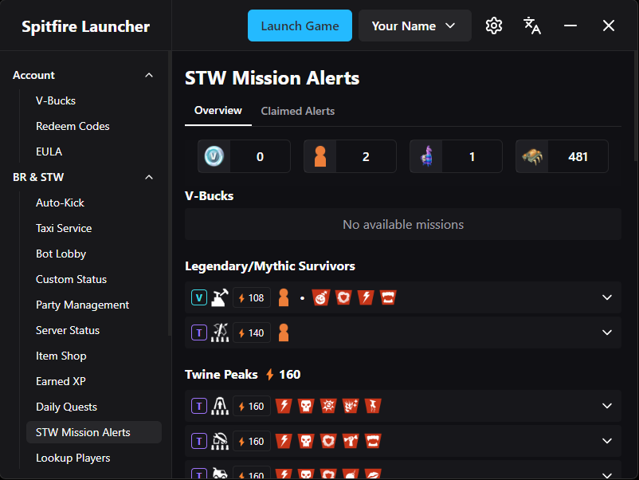

# Spitfire Launcher

A launcher for Fortnite Battle Royale and Save the World

## Table of Contents

- [📥 Installation](#installation)
- [ℹ️ Good to Know](#good-to-know)
- [⚙️ Features](#features)
- [🔄 Updating](#updating)
- [🤝 Contributing](#contributing)

## Built With

- [Svelte](https://svelte.dev) - Cybernetically enhanced web apps
- [Tailwind CSS](https://tailwindcss.com) - Rapidly build modern websites without ever leaving your HTML
- [Tauri](https://tauri.app) - Build smaller, faster, and more secure desktop applications

## Installation

Download the latest release from the [releases](https://github.com/BurakYs/Spitfire-Launcher/releases) page.

## Good to Know

On first install, a blue SmartScreen warning may appear. This is because the app is unsigned, as code signing is expensive. You can click on "Run Anyway" and continue the
installation.

Settings are stored in:

- **Windows:** `C:\Users\USERNAME_HERE\AppData\Roaming\spitfire-launcher`
- **Other platforms:** `{dataDir}\spitfire-launcher`

## Features

- **Customization:**
    - Configure launcher language, game path, starting page, starting account
- **Bulk Actions:**
    - Redeem codes, view V-Bucks information, daily quests and more across multiple accounts
- **Account and Game Management:**
    - Easy web confirmation or exchange code login
    - Launch game, auto-kick and taxis for STW, bot lobbies and custom game status
    - Manage party, view item shop, earned XP, daily quests, mission alerts
    - Lookup players, manage device authentications
- **Upcoming Features:**
    - Hero and survivor loadout, expedition management
    - Storage and backpack management
    - Friend management

## Updating

No need to uninstall. Run the setup file again to update. The app notifies when a new version is available.

## Contributing

Contributions are welcome. If you want to help improve Spitfire Launcher, follow these steps:

1. Go to the GitHub repo and create a fork.
2. Run `git clone https://github.com/YourUsername/Spitfire-Launcher.git`.
3. Use `git checkout -b your-feature-name`.
4. Implement your changes and commit them with clear messages.
5. Run `git push origin your-feature-name`.
6. Submit a pull request on GitHub.

## Credits

- [Ciensprog](https://github.com/Ciensprog) - The resources and some ideas from his [Aerial Launcher](https://github.com/Ciensprog/Aerial-Launcher) project helped me a lot.
- [LeleDerGrasshalmi](https://github.com/LeleDerGrasshalmi) - His [Endpoints Documentation](https://github.com/LeleDerGrasshalmi/FortniteEndpointsDocumentation) was really helpful.

## License

This project is licensed under the GNU General Public License v3.0 - see the [LICENSE](LICENSE) file for details.